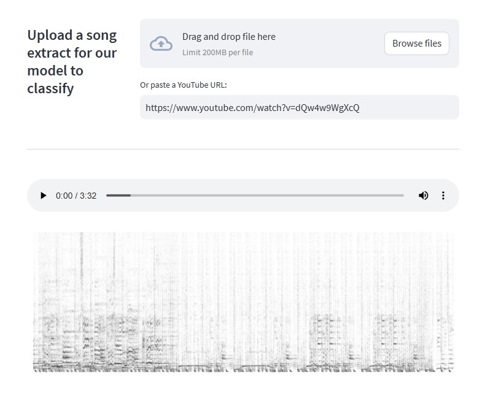
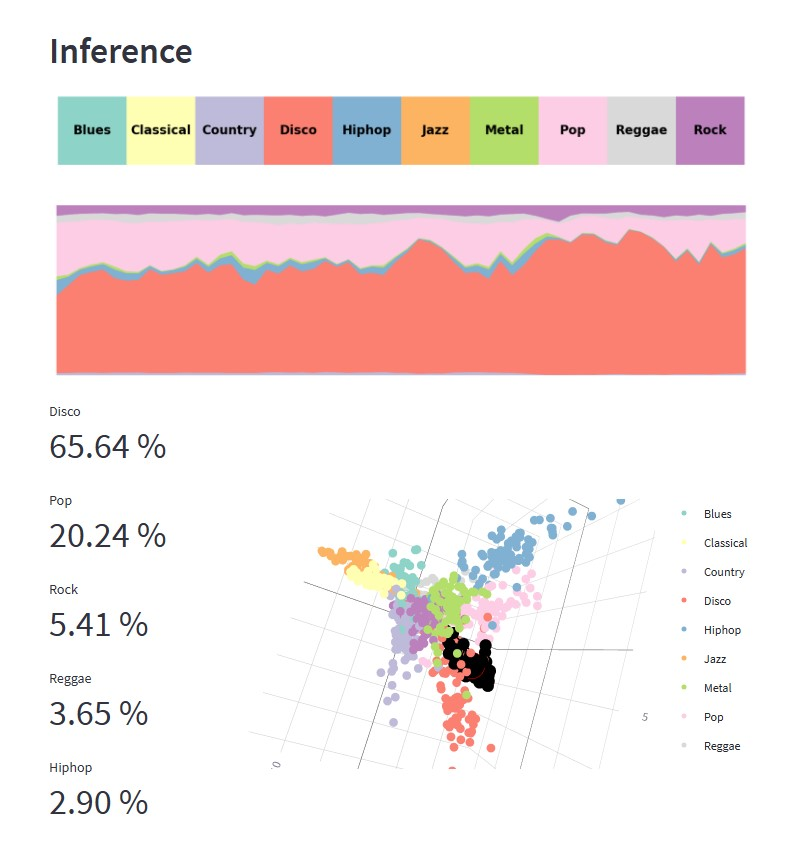

# Automatic music genre classification with Deep Learning
## A streamlit demo

---

This repo contains the code for a streamlit-based demo of our project on Deep Learning
for music genre classification as part of the Numerical Analysis for Machine Learning course at
*Politecnico di Milano*, A.Y 2022-2023.

Usage
-----
The demo consists of a streamlit app that allows you to upload an audio file
or paste a YouTube URL for the model to infer the music genre.

Once you input an audio, you will be able to hear it back and observe
its spectrogram representation.

The model will then run inference on the given audio. The stacked chart represents
the probabilities of each genre across time. The overall scores for the top-5 genres
are displayed.
Lastly, an interactive representation of the model's *latent space* is displayed. After
completion of inference, the *walk* of the given song in that feature space will be displayed
as black dots.

